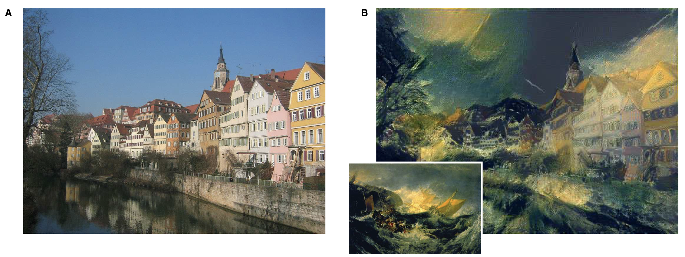

# CS464 Introduction to Machine Learning
## Term Project:  "Neural Style Transfer (NST)"

### Group Members

``Ilker Demirel`` \
``Arda B. Sumer`` \
``Alihan Kocoglu`` \
``Yusuf Unlu`` \
``Kim S. Jin``

### Project Description

Neural Style Transfer (NST), is first introduced in a paper
by Gatys et al., in 2016. The idea here
allows one to take two images, and blend them in such a way
that the content of one image will be recomposed in the style
of the other image. For instance,
assume that a person's face is chosen as the content image,
and a painting of Pablo Picasso is chosen as the style image.
NST will take these two images as inputs and will output an
image which will be the face of that person in Picasso style,
as if Picasso had drawn that person.

### Data Description

This project is a bit different in terms of its
"hunger for data" from the other machine learning tasks.
We only need content and style images to train the network
to merge these two images. A good choice of a style image 
could be the paintings of famous painters, and content image 
could be literally anything.

### Milestone Goals

``To read the paper by Gatys and have a complete understanding of the problem & model.`` \
``Learn to use pre-trained models for feature extraction, which is the backbone of this project.`` \
``Starting to implement neural network structures for the training phase.`` 

### Useful Links & Resources

[Image Style Transfer Using Convolutional Neural Networks](https://www.cv-foundation.org/openaccess/content_cvpr_2016/papers/Gatys_Image_Style_Transfer_CVPR_2016_paper.pdf)

[Neural Style Transfer | Tensorflow Tutorial](https://www.tensorflow.org/tutorials/generative/style_transfer)

